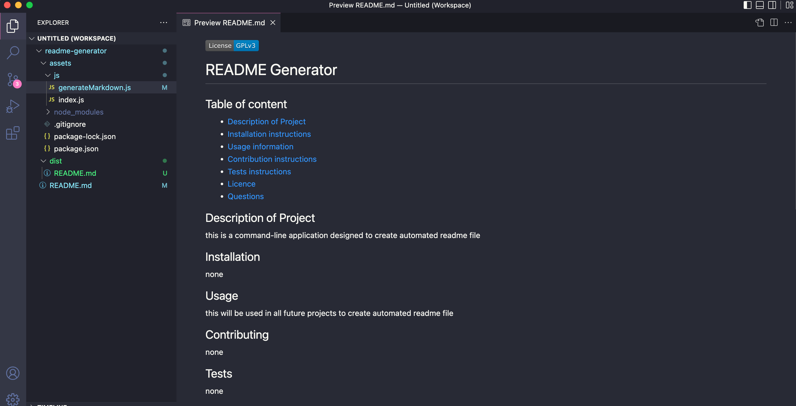

# README-generator

## Project Description

This week's challenge was to create a command-line application that dynamically generates a professional README.md file from a user's input using the Inquirer package.
As this application is not deployed, link to a walkthrough video that demonstrates its functionality needs to be provided.

The main acceptance criteria were as follow:

- When I am prompted for information about my application repository then a high-quality, professional README.md is generated with the title of my project and sections entitled Description, Table of Contents, Installation, Usage, License, Contributing, Tests, and Questions
- When I choose a license for my application from a list of options then a badge for that license is added near the top of the README and a notice is added to the section of the README entitled License that explains which license the application is covered under
- When I click on the links in the Table of Contents then I am taken to the corresponding section of the README

## Challenges

The main challenge of creating this command-line application was to make sure that the generated readme file was created in a dist folder and not within the js folder along with my javascript files. After some research I was able to implement the extra few lines of codes required and made it work.
Manually creating a table of content was something new but easily implemented once I figured the syntax.

#### Screenshot of the command-line application

#### Walkthrough video

[Link to Walkthrough video](https://youtu.be/QvjqL0HbqM8)

#### Generated README File

[Link to generated README File](https://github.com/appolinefr/readme-generator/dist/README.md)
